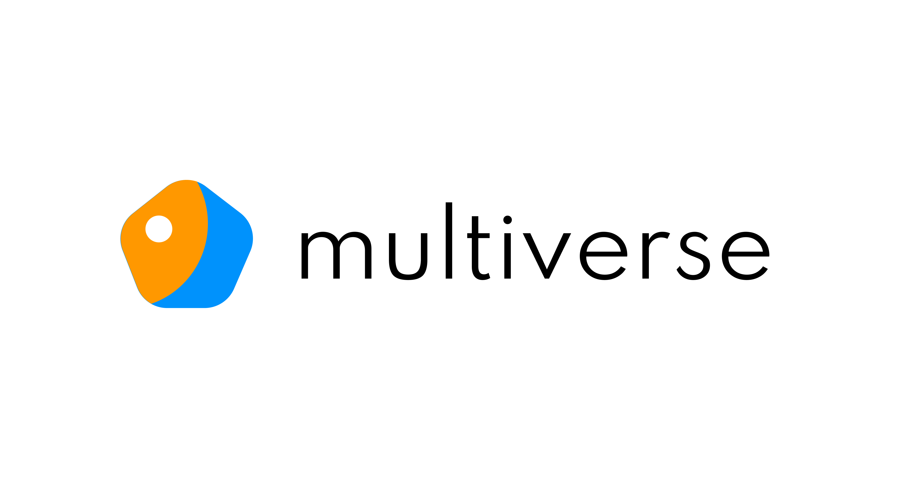

# multiverse

A mobile application powered by Flutter and AWS Amplify which provides a
one-stop solution to all campus needs.

## Motivation
In NUS, there are mainly 3/4 apps that student and staff use:
- uNivUS
- NUS NextBus
- NUS Dining
- NUS Card (deprecated; now integrated with uNivUS)

We have identified the following features that a user should have as top  
priority:
- Temperature/health declaration
- Temperature declaration reminders
- View past temperature declarations
- Bus timings
- Green pass
- Scanning and using meal credits

The following features are also important, but are not top priority:
- School map
- NUS Card QR Code
- Crowd Insight
- View exam results

Students have to switch between these apps on a daily basis and it makes
no sense to have them separated where students have to keep logging in
to separate apps to go about their daily lives in Uni. Why is there not
a good central app where it encapsulates all the features a student
needs to go about their daily lives?
